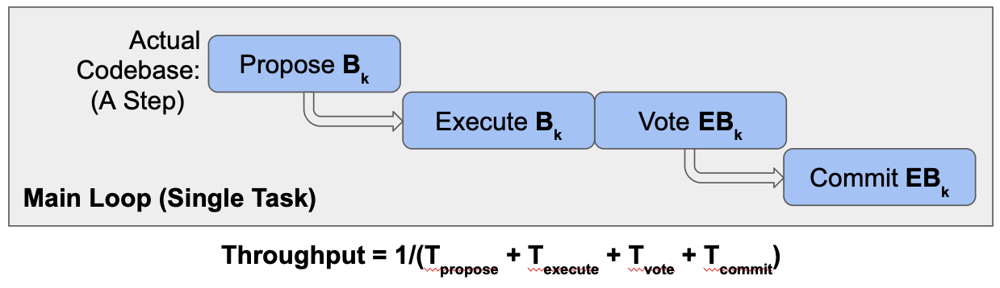

The decoupled execution mod implements the decoupled execution feature of DiemBFT protocol.

> This is an experimental feature, please use it with caution.    

# Overview

In this mod, we implemented decoupled execution. DiemBFT decouples transaction executing and committing from the consensus critical path. 
It builds an asynchronous pipeline where an ordered block gets processed by a dedicated
executing task and a dedicated committing task. This yields a better throughput as the pipelining
splits the bottleneck into smaller parts. To tolerate execution uncertainties like bit flips, DiemBFT let the
nodes agree on the execution result. The nodes asynchronously vote on the execution result. Note that, this
extra roundtrip is not piggybacked on the consensus communication (HotStuff chains), therefore, it does not
adversely affect the high throughput and low latency. To help slower nodes catch up, DiemBFT nodes also
share aggregated signatures on executed results.

# Diagram

Recall that in the DiemBFT protocol, every block goes through a number of notorizations before become decided.
Fortunately, the blocks form a pipeline of chain rule. 
On average, each round (that is not a timeout) commits a new block.
Therefore, the throughput can be roughly estimated as 1/(the time per round). 

If we look closer to the implementation (shown above), each step consists of executing the block, voting the block, 
and (after a while) committing (persisting) the block. All of these steps are on the critical path.

Therefore, the throughput is at most 1/(the time of preparation + the time of execution + the time of voting + the time of committing/persisting).

Decoupled execution moves execution and persisting to dedicated tasks. The time cost of execution and committing/persisting
are no longer on the critical path of the main loop.

By Amdahl's rule, this roughly changes the throughput to 
1/min(the time of proposing + the time of voting, the time of execution, the time of committing/persisting),
which, if ignoring the synchronization cost between tasks, is presumably better than the previous throughput.
We also decoupled the signing phase (not shown on the figure) from the main loop.

# Evaluation Results

By turning on decoupled execution feature, the throughput roughly improves 90% from the cluster benchmark.

# Implementation Details

    
            ┌──────────────────┐
            │ 2. Signing Phase │
            └──────────────▲─┬─┘
                           │ │
    ┌────────────────────┐ │ │ ┌─────────────────────┐
    │ 1. Execution Phase │ │ │ │ 4. Persisting Phase │
    └─────────────────▲─┬┘ │ │ └┬─▲──────────────────┘
                      │ │  │ │  │ │
        0. Ordered  ┌─┴─▼──┴─▼──▼─┴────┐ 3. Commit Vote  ┌─────────┐
           Blocks   │                  ├─────────────────►         │
          ┌─────────►  Buffer Manager  │                 │ Network │
          │         │                  ◄─────────────────┤         │
     ┌────┴─────┐   └─────────▲────────┘    Commit Vote  └─────────┘
     │ Ordering │             │
     │ State    │  Reset Req  │
     │ Computer ├─────────────┘
     └──────────┘

In this section, we explain how the components of decoupled execution work.
When this feature is turned on, `EpochManager` will create the above structure in `start_round_manager`.
Specifically, it will call `spwan_decoupled_execution`, create an `ExecutionPhase`, a `SigningPhase`,
a `PersistingPhase`, and a `BufferManager`, as well as the channels connecting them.
It sets the `state_computer` of `BlockStore` to be `OrderingStateComputer`, which bypasses
the execution by returning a dummy result when someone calls `compute`.

0. Whenever `commit` is called in `OrderingStateComputer`, it asynchronously sends 
the blocks, the finality proof, and the callback, to `BufferManager`.
1. The `BufferManager` creates a `BufferItem` for these inputs and enqueues them to its ordered hashmap.
Then, it pushes the buffer item to `ExecutionPhase`. The `ExecutionPhase` executes the blocks and 
sends `ExecutedBlocks` back to `BufferManager`.
2. For executed blocks, `BufferManager` sends them to `SigningPhase`, which signs the execution results
with `SafetyRules`.
3. After getting signatures from `SigningPhase`, the `BufferManager` sends out `CommitVote`s to exchange
and collect signatures.
4. Upon collecting enough signatures, `BufferManager` dequeues the item from the ordered hashmap
and sends it to `PersistingPhase`, which calls `StateComputer::commit` to persist the blocks.

`BufferManager` also handles reset requests from `OrderingStateComputer`.

# Changelog

Below is a list of changes in a topological order of dependency.
+ added a state computer class that
  + only orders the blocks without executing them
  + When `compute` is called, returns a dummy result
  + When `commit` is called, asynchronously sends it into the buffer manager
  + When `sync_to` is called, sends a `reset` to the buffer manager and proceeds into `StateComputer::sync_to`.
+ added a `StatelessPipeline` trait to cover the different stateless phases (execution, signing, persisting)
+ added a `PipelinePhase` as the engine to run those stateless phases
+ filled in the logics of different stateless phases (`ExecutionPhase`, `SigningPhase`, `PersistingPhase`).
+ added a `BufferItem` to hold batches of blocks, finality proofs, commit proofs, and callback.
+ added a `Buffer` data structure (an ordered hashmap) to hold `BufferItem`s.
+ add a `BufferManager` class to
  + receive `OrderedBlocks` from `OrderingStateComputer`
    + build `BufferItem` for them
    + enqueue the `BufferItem`
  + push the `BufferItem` into `ExecutionPhase`
  + fetch executed items from `ExecutionPhase` and push them into `SigningPhase`
  + fetch signatures from `SigningPhase` and try advance them into `BufferItem::Aggregated`
  + dequeue the aggregated `BufferItem` and push them into `PersistingPhase`
  + handle `reset` requests from outside
+ modified logics of `BlockStore` and `SyncManager` to make sure state sync path is valid.
+ added `ConsensusConfig.decoupled_execution` into on-chain configurations

# Folder Structure

    ├── README.md                           # this file
    ├── buffer.rs                           # Buffer data structure
    ├── buffer_item.rs                      # Buffer item
    ├── buffer_manager.rs                   # Buffer manager
    ├── commit_phase.rs                     # Commit Phase (Deprecated)
    ├── decoupled_execution_utils.rs        # Utils for decoupled execution
    ├── docs                                # Docs and static assets
    │   ├── after.png                       # Pics
    │   ├── before.png
    │   └── chain.png
    ├── errors.rs                           # error type
    ├── execution_phase.rs                  # execution phase
    ├── hashable.rs                         # a simple hashable trait
    ├── linkedlist.rs                       # linkedlist (deprecated)
    ├── mod.rs                              # module entry point
    ├── ordering_state_computer.rs          # state computer that does ordering only 
    ├── persisting_phase.rs                 # persisting phase
    ├── pipeline_phase.rs                   # engine that runs the stateless phases (execution, signing, persisting)
    ├── signing_phase.rs                    # signing phase
    └── tests                               # tests
        ├── buffer_manager_tests.rs         
        ├── commit_phase_tests.rs
        ├── execution_phase_tests.rs
        ├── integration_tests.rs
        ├── mod.rs
        ├── ordering_state_computer_tests.rs
        ├── persisting_phase_utils.rs
        ├── phase_tester.rs
        ├── signing_phase_tests.rs
        └── test_utils.rs

